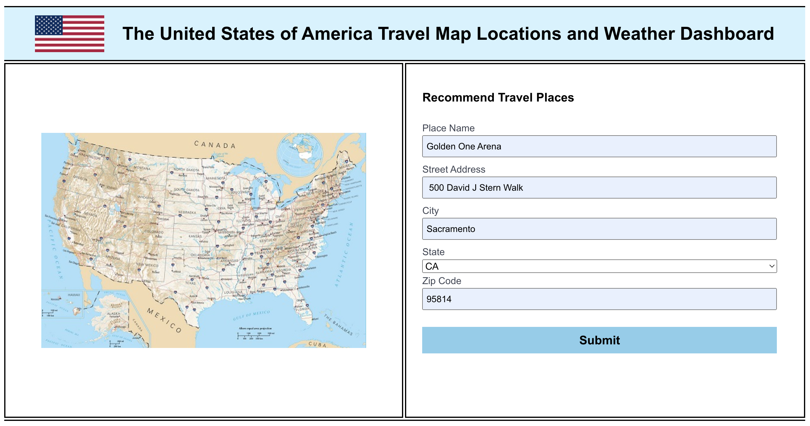

# Recommended Places and Weather Dashboard
UCB-VIRT-FSF-PT-07-2024-U-LOLC Poject 1

## User Story

```
AS A traveler / coding bootcamp classmate 
I WANT to see a map and location description displayed for a site of interest alongside a 5 day weather forecast. 
SO THAT I can plan a trip inspired by classmate recommendations or individual interest based on local weather conditions.  
 

```

## Acceptance Criteria 

```
GIVEN a travel planner map and weather dashboard landing page with form inputs
WHEN I input the address for a place of interest
THEN I am presented with a map contaning a marker designating the exact location and category of that address alongside a 5-day future weather forecast for that location

```

## Mock-Up



## Link to Deployed Application
This application is deployed to [GitHub Pages](https://dawsofd.github.io/project1-group5)